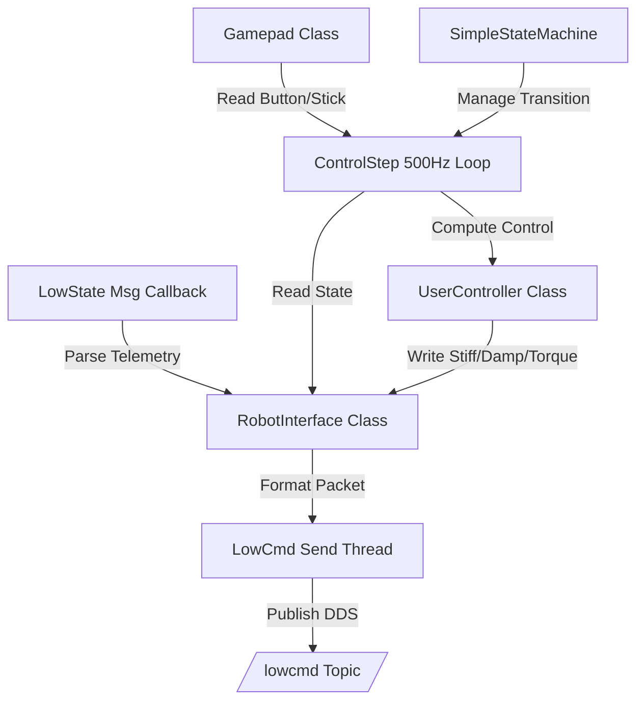

# Multithreaded Debugging & State Machine Framework

This document outlines the multithreaded architecture used to safely test control algorithms, process remote control inputs (dead zones, smoothing), and execute state machine transitions.

---

## 1. Reference Links to Archive Sources
For original code examples and class templates, refer to the archived guides:
* [[Go2_Documentation/archive/Case_reference/Deployment_Framework|Raw Deployment Framework Guide]]
* [[Go2_Documentation/archive/Case_reference/Get_Remote_Control_Status|Raw Remote Control Status Guide]]

---

## 2. Advanced Gamepad Input Processing

Raw remote control joystick values fluctuate due to physical inaccuracies, requiring dead zones and smoothing filters before ingestion by controllers.

### Button Transition Edge Detection
The `Button` helper class translates raw high/low states into edge-triggered events (`on_press`, `on_release`):
```cpp
class Button {
public:
  void update(bool state) {
    on_press = state ? state != pressed : false;
    on_release = state ? false : state != pressed;
    pressed = state;
  }
  bool pressed = false;
  bool on_press = false;
  bool on_release = false;
};
```

### Joystick Dead Zone & Exponential Moving Average
The `Gamepad` class applies a dead zone threshold (e.g. `0.01`) and a smoothing factor (e.g. `0.03`) to filter high-frequency jitter:
```cpp
void Gamepad::Update(unitree_go::msg::dds_::WirelessController_ &key_msg) {
  // Update joysticks with smoothing and deadzone thresholding
  lx = lx * (1 - smooth) + (std::fabs(key_msg.lx()) < dead_zone ? 0.0 : key_msg.lx()) * smooth;
  rx = rx * (1 - smooth) + (std::fabs(key_msg.rx()) < dead_zone ? 0.0 : key_msg.rx()) * smooth;
  ry = ry * (1 - smooth) + (std::fabs(key_msg.ry()) < dead_zone ? 0.0 : key_msg.ry()) * smooth;
  ly = ly * (1 - smooth) + (std::fabs(key_msg.ly()) < dead_zone ? 0.0 : key_msg.ly()) * smooth;

  // Update button bits (mapped from joystick.keys() bitmask)
  key.value = key_msg.keys();
  R1.update(key.components.R1);
  L1.update(key.components.L1);
  R2.update(key.components.R2);
  L2.update(key.components.L2);
  A.update(key.components.A);
  B.update(key.components.B);
}
```

---

## 3. Debugging State Machine

Safely transitioning the robot from a resting state to custom control algorithms requires three states:
1. **`DAMPING` (Safe State):** Lowers and rests the robot joints. Motors use derivative damping (`Kd = 2.0`) and zero stiffness (`Kp = 0`). Used as the start state and the emergency shutdown state.
2. **`STAND` (Preparation Stance):** Automatically stands the robot up. Joint gains `Kp` and `Kd` scale up linearly using a ratio (`pd_ratio`).
3. **`CTRL` (Custom Execution):** Executes custom control loops. Only accessible from `STAND` once the `pd_ratio` exceeds `0.95`.

### State Machine Definition (`SimpleStateMachine`)
```cpp
enum class STATES { DAMPING = 0, STAND = 1, CTRL = 2 };

class SimpleStateMachine {
public:
  SimpleStateMachine() : state(STATES::STAND), pd_ratio(0.1), delta_pd(0.005) {}

  void Stop() { state = STATES::DAMPING; pd_ratio = 0.0; }
  void Stand() { if (state == STATES::DAMPING || state == STATES::CTRL) state = STATES::STAND; }
  void Ctrl() { if (state == STATES::STAND && pd_ratio > 0.95) state = STATES::CTRL; }
  
  STATES state;
  double pd_ratio;
  double delta_pd;
};
```

---

## 4. Multithreaded Control Architecture

The execution loops run across three threads to minimize latency:
1. **State Subscriber Thread:** Subscribes to `/lowstate` (dds) at high frequency, parsing IMU and joint telemetry into `RobotInterface`.
2. **Control Loop Thread (`ControlStep`):** Iterates at 500 Hz. Performs gamepad readings, evaluates state transitions, computes control equations, and writes output commands.
3. **Command Publisher Thread:** Publishes the populated `LowCmd` packet to `/lowcmd` at high frequency.



---

## 5. Software Emergency falldowns & Safety Triggers

If the control algorithm becomes unstable, the system must trigger an automatic safety shutdown to prevent physical damage.

### Gravity Vector Safety Check
The `CheckTermination()` function projects the gravity vector onto the robot's body coordinate system. If the robot tilt angle exceeds 90 degrees (tilt threshold, e.g. `projected_gravity.z > 0`), the system triggers a shutdown:
```cpp
bool CheckTermination() {
  // If projected gravity along Z-axis is positive, the robot is tilted sideways or upside down
  if (robot_interface.projected_gravity.at(2) > 0.0) {
    return true; // Trigger emergency stop
  }
  return false;
}
```
If `CheckTermination()` returns `true`, the state machine immediately transitions to `STATES::DAMPING`, dumping motor gains.

---

## 6. Project Relevance
* **Orchestration Loop:** Our state machine node (`go2_state_orchestrator`) uses this multithreaded architecture.
* **Safety Integration:** Incorporating the projected gravity test prevents the robot from burning out its joint motors during calibration or SLAM failures in dynamic industrial areas.
