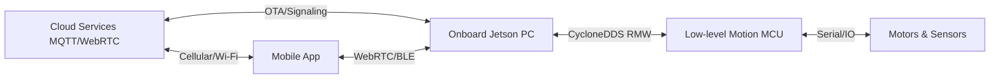

# System Architecture & DDS Middleware

This document covers the high-level hardware-software boundaries, cloud interfaces, Bluetooth security, and native DDS middleware architectures of the Go2.

---

## 1. Reference Links to Archive Sources
For original system diagrams and raw descriptions, refer to the archived guides:
* [Raw Architecture Description](file:///home/mamdaliof/Documents/GitHub/mamdaliof-obsidian/02-Projects/learning-factory-project/Go2_Documentation/archive/SDK_Concepts/Architecture_Description.md)
* [Raw Basic Application Concept](file:///home/mamdaliof/Documents/GitHub/mamdaliof-obsidian/02-Projects/learning-factory-project/Go2_Documentation/archive/SDK_Concepts/Robot_Dog_Application/Basic_Application.md)
* [Raw DDS Application Concept](file:///home/mamdaliof/Documents/GitHub/mamdaliof-obsidian/02-Projects/learning-factory-project/Go2_Documentation/archive/SDK_Concepts/Robot_Dog_Application/DDS_Application.md)

---

## 2. Global System Interactions & Information Pipelines

The Go2 information loop connects local actuator control, onboard Jetson perception, cloud services, and the controller app:



* **Cloud Services:** Handles remote control signaling via WebRTC, utilizing TURN/STUN servers to forward compressed audio, video, and point cloud streams when direct peer-to-peer connections fail.
* **Bluetooth (BLE) Module:** Used exclusively for close-range security validation and initial Wi-Fi credential configuration.
* **EDU Multimedia Pipelines:** The high-level computing boards on the EDU version support GStreamer (GST) video streaming directly from the cameras.

---

## 3. DDS Middleware & ROS 2 Compatibility

The communication framework of the Go2 functional modules is built on **DDS (Data Distribution Service)**, adopting a decentralized publish/subscribe model that ensures real-time telemetry distribution.

### ROS 2 Compatibility
* **RMW Compatibility:** The DDS IDL (Interface Definition Language) structure is compatible with ROS 2. By configuring an adaptive ROS Middleware (RMW) driver, the EDU version allows developers to subscribe to sensor topics and command motions directly using native ROS 2 nodes.
* **Sensor Collection:** Raw data from motors, LiDAR range-finders, and UWB tags are aggregated by microcontroller units (MCUs) via high-speed serial ports and immediately forwarded as DDS messages to the Jetson processor.

---

## 4. Basic Application Control Block

The fundamental control structure manages the flow between hardware state readings and high-level directives:

```
[Sensors/Actuators] 
       │ (Motor angles, battery telemetry, IMU status)
       ▼
[Basic Service Interface] 
       │ (Parses raw packets to DDS topics)
       ▼
[Motion Control Service (mcf/sport_mode)] 
       │ (Computes gait, stance, and balance vectors)
       ▼
[Actuator Command Output] 
       │ (Sends FOC joint targets to hardware)
       ▼
[Joint Motors & Battery MCU]
```

---

## 5. Project Relevance
* **Hybrid DDS/ROS 2 System:** Our code runs on the onboard Jetson NX. We write standard ROS 2 Jazzy nodes to interact with the robot, utilizing CycloneDDS configuration files to route high-rate telemetry between the MCU and our localization nodes with minimal overhead.
