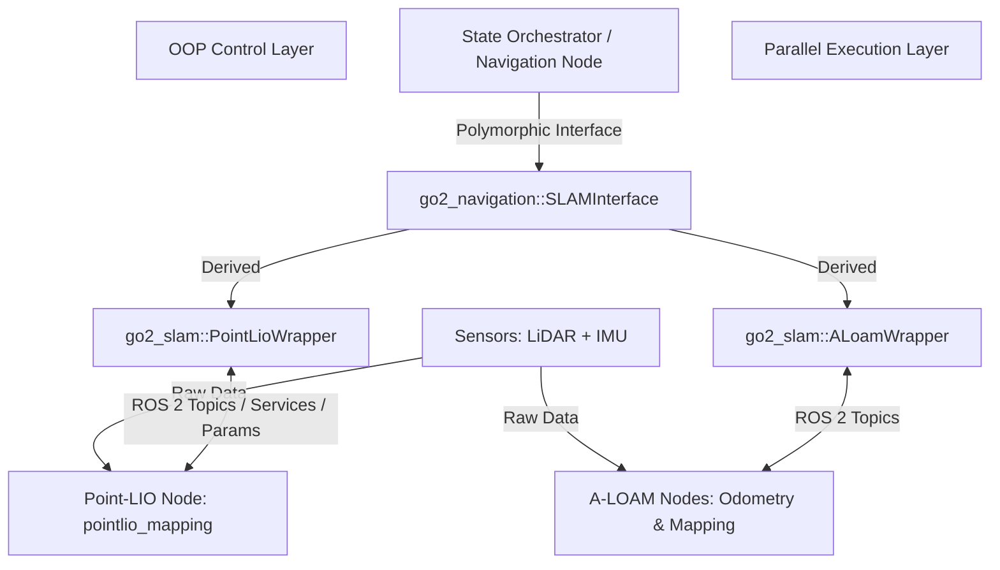

# SLAM & OOP Collaboration Architecture

This document explains the structural collaboration between the parallel ROS 2 node architecture (Point-LIO, A-LOAM) and the C++ Object-Oriented Programming (OOP) interfaces defined in our project.

---

## 1. Architectural Overview: The Two Layers

The system is split into two distinct, collaborating layers:
1. **Parallel Execution Layer (Dataflow Layer / ROS 2 Graph):** Decentralized, parallel nodes processing raw sensor feeds.
2. **OOP Control & Orchestration Layer (Logical Layer):** Polymorphic C++ classes providing a unified, type-safe API for high-level planners and state machines.



---

## 2. Dynamic Polymorphism (Swappability)

High-level modules (such as path planners and navigation state machines) do not interact with SLAM nodes directly. Instead, they interact with `go2_navigation::SLAMInterface`. 

This enables **hot-swapping** the SLAM backend without modifying high-level control logic:

```cpp
// Instantiation in high-level navigation node
go2_navigation::SLAMInterface::SharedPtr slam_backend;

if (use_point_lio) {
    slam_backend = std::make_shared<go2_slam::PointLioWrapper>(node);
} else {
    slam_backend = std::make_shared<go2_slam::ALoamWrapper>(node);
}

// Rest of navigation code remains 100% unchanged:
slam_backend->Init();
slam_backend->StartMapping();
...
geometry_msgs::msg::PoseStamped current_pose;
if (slam_backend->Localize(current_pose)) {
    planner->ComputePath(current_pose, goal, path);
}
```

---

## 3. Collaboration Mechanisms: How Wrappers Control Parallel Nodes

Since the SLAM algorithms run in parallel processes, the OOP wrapper classes translate virtual function calls into ROS 2 Inter-Process Communication (IPC) calls:

### 3.1 Localization Retrieval (`Localize`)
- **Parallel Action:** The SLAM node estimates the state and publishes it on a ROS 2 topic (e.g., `/state_estimation` for Point-LIO, `/aft_mapped_to_init` for A-LOAM).
- **OOP Collaboration:** The wrapper class maintains an internal subscriber to that topic in a thread-safe helper callback. When the high-level code calls `Localize(pose)`, the wrapper quickly extracts the latest cached value from memory without blocking.

### 3.2 Dynamic Map Saving (`SaveMap`)
- **Point-LIO:**
  1. The wrapper uses a ROS 2 client to dynamically change the `map_save_path` parameter on the running `/laserMapping` node.
  2. The wrapper sends an asynchronous trigger request to the `/save_map` service.
  3. The parallel Point-LIO node processes the service request, flattens its internal coordinate tree, and writes the PCD file.
- **A-LOAM:**
  1. The wrapper subscribes to the `/laser_cloud_map` topic.
  2. It keeps the latest point cloud copy in memory.
  3. When `SaveMap` is triggered, the wrapper directly flattens the cloud and writes the PCD file from the controller process.

### 3.3 Kidnap Detection & Safety Watchdogs (`CheckKidnapStatus`)
- **Collaboration:** The wrapper acts as a watchdog, tracking the time delta between incoming odometry messages. If a parallel SLAM node crashes, hangs, or fails to output pose estimates within a 1.5s threshold, the wrapper flags a kidnap state, triggering a safe emergency halt in the robot state machine.
